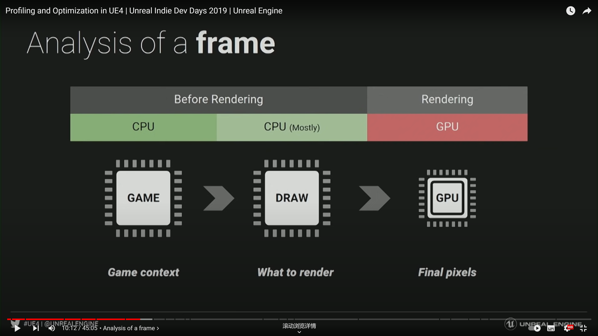
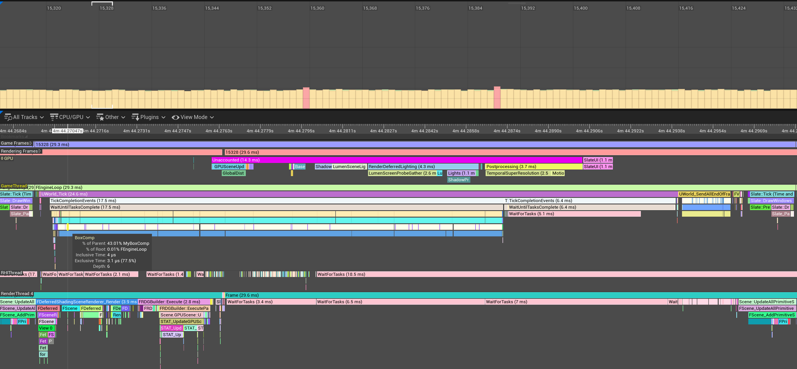
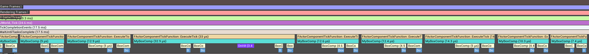
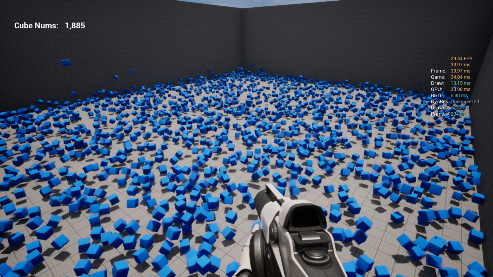

# Collision System in Unreal 5

## Structure

### Custom Object Movement

- Inherit from MovementComponenet

- Update objects with custom motion logic \(forwarding\, bounce\, etc\.\)

### Objects Management

- Spawned, Maintained and Controlled by an upper Actor

## System Overview

### customize object movement

| Real World Forwarding            | Spin Forwarding                                              |
| -------------------------------- | ------------------------------------------------------------ |
|  |  |

### object management

#### Generating Objects – A Variety of Ways

- Random Spawning
- Fire-working Spawning
- Continuous Spawning

<video src="img/Object Management.mp4" width="800px" height="600px" controls="controls"></video>

#### Control

- Speed Control
- Location Control

<video src="img/Object control.mp4" width="800px" height="600px" controls="controls"></video>

## Performance Analysis

### Statics

#### Platform

| OS   | Windows 11        |
| ---- | ----------------- |
| CPU  | Intel i5\-12600KF |
| GPU  | Nvidia RTX 3060   |
| RAM  | 32G               |

#### Test Settings

- Play in Standalone Mode

- Minimize the Editor

- Turn off Frame Rate Smoothing

- Turn off Vsync \(r\.vsync 0\)​​​

### Results

30 fps @ 1500 cubes

| Procedure | Time (ms) |
| :-------- | --------- |
| Frame     | 30.41 ms  |
| Game      | 30.33 ms  |
| Draw      | 11.43 ms  |
| GPU       | 30.37 ms  |

### Analysis of Bottleneck

How to make a frame

Ref: Profiling and Optimization in UE4,  https://youtu.be/EbXakIuZPFo

#### Game Operation: In one Loop

1499: MyBoxComp, name of the custom Movement Component

3236: BoxComp, twice than the previous

136: OnHit, count on small portion

Solution: reduce the Complexity of MyBoxComp

### Solutions

#### CPU

- Reduce the Complexity of MyBoxComp

#### GPU

- Enable LOD, Level of Details

- Enable dynamic resolution or reduce resolution

#### Results: Reaches 1885 cubes @ 30 fps

## Future Goal

Reduce the Draw Calls

Problem:

GPU is still rendering when there’s no cubes in the view

Goal:

When there’s no cubes in the view,

GPU should not render those cubes

## Key Techniques

- Tick & TickComponent: where object updates

- OnHit: when hit happens

- MyWorld->SpawnActor: spawn an actor

- TActorIterator\<AActor\> ActorItr: Iteration

- ActorItr->GetClass(): Compare class

- Component Hierarchy: Root Comp, Static Mesh Comp, Updated Comp …

- Unreal Insights and stat commands

- And so on …
